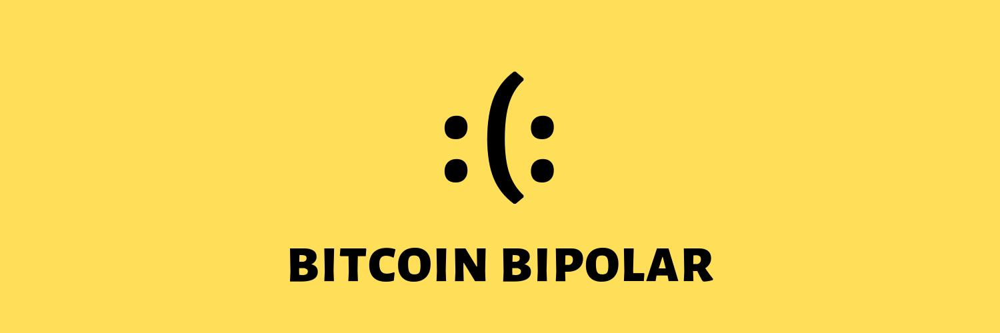

	

<h3 align="center">Cripto Bipolar</h3>

Informações em tempo real sobre o valor das criptomoedas no seu feed do Twitter.

    

 

<h5 align="center"> 
🚧 Ativo 🚧
</h5>

---

## O que é?
Este é o código que mantém a conta [@Cripto_Bipolar](https://twitter.com/Cripto_Bipolar) funcionando, verificando por alterações notáveis no preço das criptomoedas e se ocorreu um _halving_.

Ele consome a API do Twitter para postagem das atualizações, e as APIs do [coingecko.com](https://www.coingecko.com/en/api) e [blockchain.com](https://www.blockchain.com/) (_antiga blockchain.info_) para verificação dos preços, blocos minerados até o momento e variação do preço nas últimas 24 horas.
